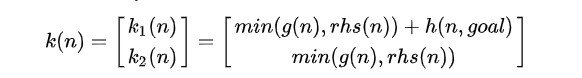

# C++ Capstone Project

## Overview:
Longlife planning A*(LPA*) algorithm is an incremental version of A*, which can adapt to changes in the graph without recalculating the entire graph, by updating the g-values (distance from start) from the previous search during the current search to correct them when necessary. Like A*, LPA* uses a heuristic, which is a lower boundary for the cost of the path from a given node to the goal. A heuristic is admissible if it is guaranteed to be non-negative (zero being admissible) and never greater than the cost of the cheapest path to the goal.

## Predecessors and Successors:
Except the start and end point, each node n has its preedecessors and successors
- Any node from which an edge leads towards n is a predecessor of n.
- Any node to which an edge leads from n is a successors of n.

## Distance estimation:
LPA* maintains two estimates of the start distance g*(n) for each node:
- g(n) the previously calculated g-value (start distance) as in A*
- rhs(n) a lookahead value based on the g-values of the node’s predecessors (the minimum of all g(n' ) + d(n' , n), where n' is a predecessor of n and d(x, y) is the cost of the edge connecting x and y)

## OpenList:
When a node become locally inconsistant, it should be put in the openList for the further evaluation. LPA* use two dimensional keys to sort the OpenList. 


```
auto cmp = [](node n1, node n2){
    return (n1.k1<n2.k1)||(n1.k1==n2.k1 && n1.k2<n2.k2);
};
```
The comparsion function shown above is for LPA* openList.

## Node expansion:
The top node in the openList is expanded as follows:
- If the rhs-value of a node equals its g-value, the node is locally consistent and is removed from the openList
- If the rhs-value of a node is less than its g-value (known as a locally overconsistent node), the g-value is changed to match the rhs-value, making the node locally consistent. The node is then removed from the openList
- If the rhs-value of a node is greater than its g-value (known as a locally underconsistent node), the g-value is set to infinity (which makes the node either locally overconsistent or locally consistent). If the node is then locally consistent, it is removed from the openList, else its key is updated.
The termination of the node expansion:
- The goal is locally consistent, and
- The node at the top of the openList has a key which is greater than or equal to the key for the goal.
```
while(openList.topKey()<keys(Goal)||goal.rhs==goal.h){
        // Node expansion
}

```

## Initialization:
The graph is initialized by setting the rhs-value of the start node to 0 and its g-value to infinity. For all other nodes, both the g-value and the rhs-value are assumed to be infinity until assigned otherwise. This initially makes the start node the only locally inconsistent node, and thus the only node in the queue. After that, node expansion begins. The first run of LPA* thus behaves in the same manner as A*, expanding the same nodes in the same order.

## Edge cost changes:
When the cost of an edge changes, LPA* examines all nodes affected by the change, i.e. all nodes at which one of the changed edges terminates (if an edge can be traversed in both directions and the change affects both directions, both nodes connected by the edge are examined):
- The rhs-values of the nodes are updated.
- Nodes which have become locally consistent are removed from the queue.
- Nodes which have become locally inconsistent are added to the queue.
- Nodes which remain locally inconsistent have their keys updated.

## Construct the shortest Path
During the expansion, it is useful to use a backpointer to track the successor. when the end point is reached, the backpointer can be used to trace back to the start point, then the shortest path can be found.

## pseudo code


---
## Explanation of Code:

### Dependencies for Running Locally

- cmake >= 3.7
- make >=4.1(Linux,Mac),3.81(windows)
- gcc/g++ >=5.4

### Build and Run Intructions

```sh
$ mkdir build && cd build
$ cmake ..
$ make
$ ./planning
```

### Structure of code 
* Node class is used to represent the each point in the map. Each node should contains: 
    * The locations (x and y coordinates)
    * The cost (g and rhs), 
    * The backpointer( point back to the successor )
    * The status of the node (start, end, obstacle, path,road)
* Map class is used to manage the information of the grid map:
    * The dimension of map (row and column)
    * The start and end point
    * The road, obstacle and path position
    * unable to find the valid neighbors of the current node in map (Manhattan Grid 4-dir)
* LPAStar class is the path planner for current map:
    * Initialization
    * Planner
    * Construct ideal path
    * Find unexpected obstacle --> environment change need replanning
    * Update the map information
    * replanning using longlife planning A*
    * Generate and plot the new shortest path
    
### Output example
After running the program, users need to enter the value of desired row and column number(e.g. 10). Then, users need to assign the starting and ending position on the map (based on the dimensions of the map). Finally, users need to decide how many obstacles in the map.The obstacle positions are randomly generated on the map. Too many obstacles may cause the planner can't find the path. The following example output use (row = 10, col = 10, startx = 0, starty = 0, endx = 9, endy 9, obstacle number = 20);

In the result, '#' represent the shortest path points, '.' represents the open road, '@' represents the obstacle, 'S' is the starting point, 'E' is the end point.  


The edge cost of one trajectory point changes, in the example is [2,5]


The LPA* algorithm re-plan the trajectory


### Project requirements

- The project demonstrates an understanding of C++ functions and control structures.

- The project accepts user input and processes the input. (In main.cpp  #line 34- 47)

- The project uses Object Oriented Programming techniques. (Program contains Node class, Map class, and LPAStar class)

- Classes use appropriate access specifiers for class members.

- Class constructors utilize member initialization lists.(in Node class, Map class, and LPAStar class)

- Classes encapsulate behavior.(only provide some useful interface function to the users in each class)

- The project makes use of references in function declarations.(Map.cpp #line 41, Planner.cpp #line 130)

- The project uses smart pointers instead of raw pointers. (use the std::shared_ptr)
